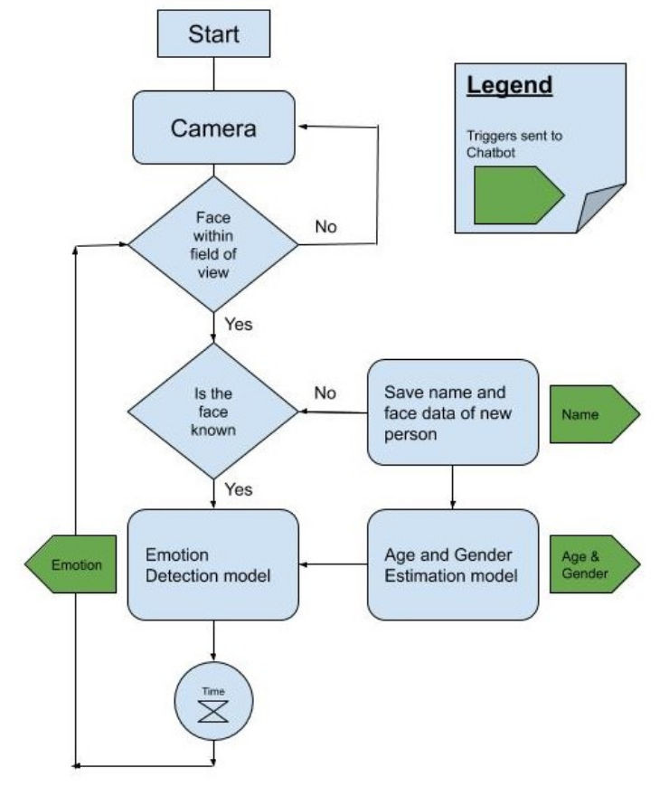
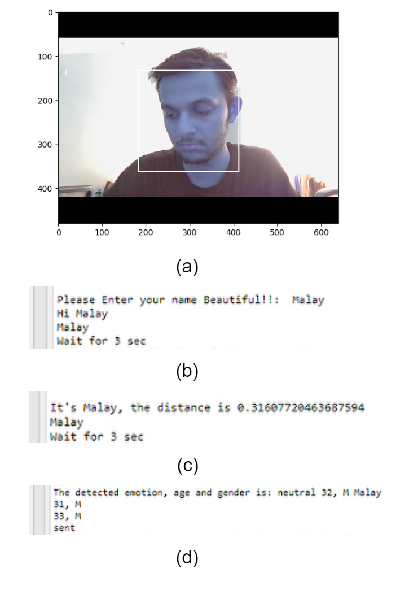
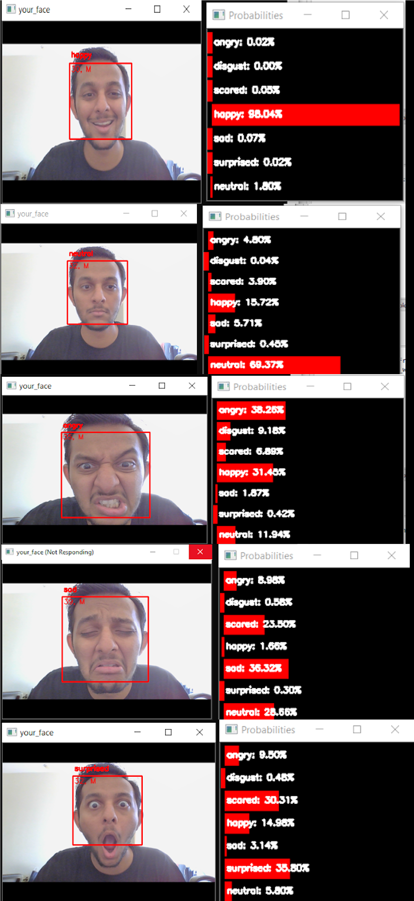
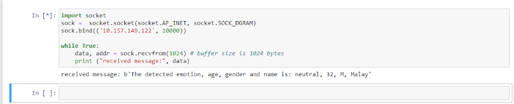

# Face Recoginition, Emotion, Age and Gender Detection in One System
 
The objective of the project was to have face recoginition, emotion detection, age and gender estimation in one system. We first tested the three systems individually and then went forward to combine them. 

## Getting Started
We implemented the project on a Windows machine using Spyder IDE and TensorFlow 1.x. I have updated the code to be compatible with TensorFlow 2.0. 

  
  
 Overview of how the entire system works.

  
  
One-shot Learning. a) Face of the person captured. b) Person is not in the system. c) Person stored in the database. d) Person re-appears in front of the camera and
the AI agent recognizes the person
.

  

Emotion, Age and Gender Detection

  
  
UDP Connection Result with another system

  
  
Final system in action

## Authors
* Abdul Mohd Wahab- face recognition and emotion detection models  
* Amith Lawrence- face recognition and emotion detection models
* Anusha Vaidya- age and gender estimation model, UDP communication
* Malay Nagda- age and gender estimation model, UDP communication and combining the three systems
* Shivani Shah- literature review, code debugging, protyping and final face recognition and emotion detection models

## Acknowledgements
Dr. Suren Jayasuriya and Mr. Christian Ziegler were are mentors for the project and gave valuable guidance in terms of the expectation of how the final system should look like.
